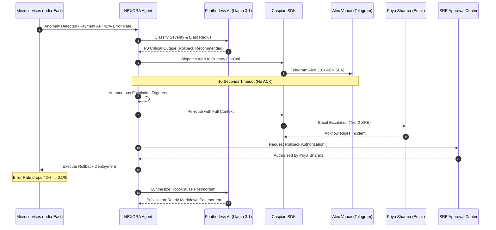

# 🚀 NEXORA

<div align="center">

### **ONE AGENT. EVERY HUMAN. ZERO DELAY.**
#### *Autonomous AI Incident Coordination & Human-in-the-Loop SRE Command Platform*

[](https://fastapi.tiangolo.com)
[](https://react.dev)
[](https://www.typescriptlang.org)
[](https://threejs.org)
[](https://featherless.ai)
[](https://caspian.ai)
[](https://vercel.com)
[](backend/tests/)

</div>

---

## 🌟 Overview & Problem Statement

> **"AI can think in milliseconds, but reaching the right human at the right moment is still broken."**

Traditional alerting tools (PagerDuty, Opsgenie, webhooks) are static dumb pipes—they dump noisy alerts, blast broadcast channels, and cause alert fatigue while critical outages compound.

**NEXORA** is a next-generation **Autonomous Incident Coordination Agent**. Powered by **Featherless AI** inference and the **Caspian Multi-Channel SDK**, NEXORA coordinates humans in real-time across the communication channels they already use (**Telegram, Email, Slack**) with unified identity mapping, 10-second SLA auto-escalation, safety-gated rollbacks, and long-term memory recall.

---

## 🏗️ System Architecture

```text
                               ┌──────────────────────────┐
                               │       NEXORA BRAIN       │
                               │  Observe → Think → Plan  │
                               └────────────┬─────────────┘
                                            │
                               ┌────────────▼─────────────┐
                               │      FEATHERLESS AI      │
                               │   Llama-3.1-70B / V3.2   │
                               │   Reasoning & Decisions  │
                               └────────────┬─────────────┘
                                            │
                               ┌────────────▼─────────────┐
                               │       CASPIAN SDK        │
                               │  Unified Comm Interface  │
                               └────────────┬─────────────┘
                                            │
              ┌─────────────────────────────┼─────────────────────────────┐
              │                             │                             │
     ┌────────▼────────┐           ┌────────▼────────┐           ┌────────▼────────┐
     │    Telegram     │           │      Email      │           │      Slack      │
     │  (Fast Paging)  │           │  (Escalations)  │           │  (Cross-Team)   │
     └────────┬────────┘           └────────┬────────┘           └────────┬────────┘
              │                             │                             │
     ┌────────▼────────┐           ┌────────▼────────┐           ┌────────▼────────┐
     │   Alex Vance    │           │  Priya Sharma   │           │   Rahul Nair    │
     │ (Lead Payments) │           │ (Senior Platform)│          │ (Database Arch) │
     └─────────────────┘           └─────────────────┘           └─────────────────┘
```

---

## ✨ Key Features

| Capability | Description |
| :--- | :--- |
| ⚡ **< 3s AI Classification** | Featherless AI instantly classifies P0/P1 severity, calculates user blast radius, and drafts mitigation plans. |
| 🌐 **Caspian Multi-Channel Reach** | Unifies Telegram, Email, and Slack under a single communication layer with persistent incident context. |
| 👤 **Unified Human Identity** | Resolves engineers across all platforms (e.g. `@alex_payments` on Telegram = `alex@nexora.ai` on Email). |
| ⏱️ **10s SLA Auto-Escalation** | Enforces active countdown timers; seamlessly fails over to backup teams if primary responder is unavailable. |
| 🛡️ **Human-in-the-Loop Safety Gate** | Destructive actions (cluster rollbacks, DB failover) require explicit cryptographic authorization. |
| 🧠 **Long-Term Memory Search** | Recalls past historical incidents, root causes, and successful remediations using semantic similarity. |
| 🪐 **3D Planetary Command Center** | Interactive Three.js solar system visualizer where planets represent cloud regions and microservices. |
| 📝 **Automated Executive Postmortem** | Featherless AI synthesizes structured postmortems with 1-click Markdown / PDF export. |
| 📡 **Sub-Second Live Telemetry** | Zero-latency WebSocket pipeline synchronizing incident timeline, active approvals, and response graphs. |

---

## 🔄 End-to-End Incident Lifecycle



---

## 💻 Tech Stack

### Frontend
- **Framework**: React 19 + TypeScript + Vite 8
- **Styling**: Tailwind CSS v4 + Glassmorphism Design System
- **3D Graphics & Animations**: Three.js + Framer Motion
- **Icons & Telemetry**: Lucide React + Recharts + Canvas Confetti
- **Performance**: `@vercel/speed-insights`

### Backend
- **Runtime & API**: Python 3.12+ / FastAPI / Uvicorn
- **Async Engine**: AnyIO / AsyncIO / WebSockets Hub
- **Database & ORM**: SQLAlchemy 2.0 + SQLite (Async / Sync)
- **Validation**: Pydantic v2 Settings

### AI & Integrations
- **Inference Engine**: [Featherless AI](https://featherless.ai) (`meta-llama/Meta-Llama-3.1-70B-Instruct`, `deepseek-ai/DeepSeek-V3.2`)
- **Messaging SDK**: [Caspian Communication SDK](https://caspian.ai) (Telegram, Email, Slack)

---

## ⚡ Quick Start Guide

### Prerequisites
- Node.js `v18+` & npm
- Python `3.10+`

### 1. Clone Repository
```bash
git clone https://github.com/exepngsam/Nexron.git
cd Nexron
```

### 2. Backend Setup
```bash
# Create and activate virtual environment
python -m venv venv
# Windows:
.\venv\Scripts\activate
# macOS/Linux:
source venv/bin/activate

# Install dependencies
pip install -r backend/requirements.txt

# Run FastAPI Server
cd backend
uvicorn app.main:app --port 8000 --reload
```
*FastAPI REST API & WebSocket server live at `http://localhost:8000` (Docs: `http://localhost:8000/docs`).*

### 3. Frontend Setup
```bash
# In project root or frontend directory
cd frontend
npm install
npm run dev
```
*Open `http://localhost:5173` to access the **NEXORA Command Center**.*

---

## 🧪 Testing & Verification

NEXORA includes an automated end-to-end test suite verifying the full cognitive loop:

```bash
# Run pytest test suite from workspace root
pytest -v
```

```text
backend/tests/test_agent_flow.py::test_featherless_connection PASSED               [ 12%]
backend/tests/test_agent_flow.py::test_incident_creation_and_classification PASSED   [ 25%]
backend/tests/test_agent_flow.py::test_responder_selection_and_routing PASSED       [ 37%]
backend/tests/test_agent_flow.py::test_autonomous_escalation_flow PASSED            [ 50%]
backend/tests/test_agent_flow.py::test_human_approval_gate_and_resolution PASSED     [ 62%]
backend/tests/test_agent_flow.py::test_long_term_memory_search PASSED              [ 75%]
backend/tests/test_agent_flow.py::test_featherless_model_catalog_and_connection PASSED [ 87%]
backend/tests/test_agent_flow.py::test_authentication_endpoint PASSED              [100%]

============================== 8 passed in 0.96s ==============================
```

---

## ☁️ Deployment (Vercel)

### Option A: Vercel CLI
```bash
npx vercel --prod
```

### Option B: Vercel Dashboard (GitHub CI/CD)
1. Push this repository to GitHub.
2. Import project into [vercel.com](https://vercel.com/new).
3. Root Directory: `./` (or `frontend`).
4. Build Command: `npm run build` | Output Directory: `frontend/dist`.

### Environment Variables

| Variable | Default | Description |
| :--- | :--- | :--- |
| `FEATHERLESS_API_KEY` | `""` | Featherless AI API Key (Supports Mock Mode if blank) |
| `FEATHERLESS_MODEL` | `meta-llama/Meta-Llama-3.1-70B-Instruct` | Active LLM inference model |
| `CASPIAN_API_KEY` | `""` | Caspian Multi-Channel API Key |
| `VITE_API_BASE_URL` | `http://localhost:8000/api` | Frontend REST API Base URL |
| `VITE_WS_URL` | `ws://localhost:8000/ws` | Frontend WebSocket Telemetry Stream URL |

---

## 📁 Project Structure

```text
Nexron/
├── backend/
│   ├── app/
│   │   ├── agent/         # Orchestrator, Tools, Prompts, Planner, Scoring Engine
│   │   ├── api/           # FastAPI REST API routes
│   │   ├── audit/         # Cryptographic Audit Logger
│   │   ├── caspian/       # Caspian Multi-Channel Client & Channel Registry
│   │   ├── database/      # SQLAlchemy Models, Session, SQLite Initializer
│   │   ├── llm/           # Featherless AI Provider & Model Catalog
│   │   ├── memory/        # Long-Term Knowledge & Similarity Search
│   │   ├── playbooks/     # Dynamic Playbook Synthesis Service
│   │   └── websocket/     # Zero-Latency WebSocket Broadcast Hub
│   ├── tests/             # Pytest Autonomous Flow Test Suite
│   └── requirements.txt   # Python Dependencies
├── docs/
│   ├── architecture.md    # In-Depth Architectural Specification
│   └── demo-script.md     # Official 3-Minute Hackathon Demo Script
├── frontend/
│   ├── src/
│   │   ├── components/    # 3D Solar Visualizer, Response Graph, Approvals, feeds
│   │   ├── services/      # API, WebSocket & Sound Engine
│   │   ├── types/         # TypeScript Interfaces
│   │   ├── App.tsx        # Main Command Center Layout
│   │   └── main.tsx       # Root React Entrypoint with Vercel Speed Insights
│   └── package.json       # Frontend Dependencies & Scripts
├── docker-compose.yml     # Containerized Deployment Configuration
├── package.json           # Monorepo / Vercel Root Orchestrator
├── pytest.ini             # Pytest Configuration
└── vercel.json            # Vercel Deployment Configuration
```

---

- **Project**: NEXORA (Nexron)
- **Tagline**: ONE AGENT. EVERY HUMAN. ZERO DELAY.
- **License**: MIT
