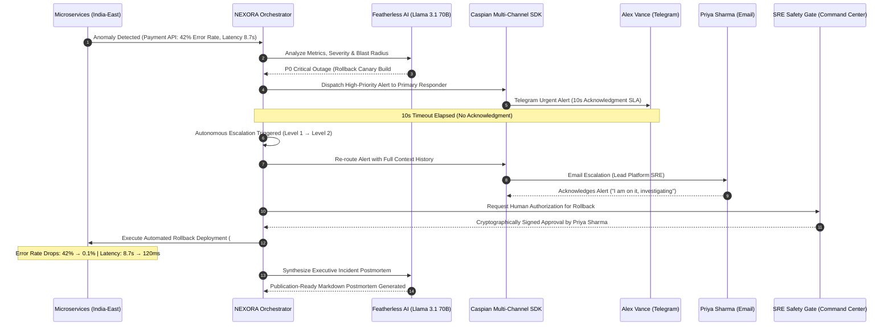

# 🚀 NEXORA

<div align="center">

### **ONE AGENT. EVERY HUMAN. ZERO DELAY.**
#### *Autonomous AI Incident Coordination & Human-in-the-Loop SRE Command Platform*

[](https://fastapi.tiangolo.com)
[](https://react.dev)
[](https://www.typescriptlang.org)
[](https://threejs.org)
[](https://tailwindcss.com)
[](https://featherless.ai)
[](https://caspian.ai)
[](https://vercel.com)
[](backend/tests/)
[](LICENSE)

<br />

[Explore Features](#-key-features) • [System Architecture](#-system-architecture) • [Quick Start Guide](#-quick-start-guide) • [Featherless AI & Caspian](#-featherless-ai--caspian-sdk-integration) • [API Reference](#-api-reference) • [Testing](#-testing--verification)

</div>

---

## 🌟 Executive Overview & Problem Statement

> **"AI can reason in milliseconds, but reaching the right human at the right moment across fractured tools is still broken."**

During critical production outages, Site Reliability Engineers (SREs) and DevOps teams lose up to **45 minutes** navigating fragmented communication silos:
- ❌ **Alert Fatigue & Noise:** Static alerting tools (PagerDuty, Opsgenie, raw webhooks) dump unprioritized alert storms into crowded Slack channels.
- ❌ **Identity Fragmentation:** Engineers operate across mismatched handles (`@alex_vance` on Telegram, `alex@nexora.ai` on Email, `@alex.payments` on Slack).
- ❌ **Dead Air Escalation Gaps:** If a primary responder is asleep or offline, critical minutes tick away before secondary teams are manually paged.
- ❌ **Context Amnesia:** Every platform hop forces responders to re-read disconnected threads and restart troubleshooting from scratch.
- ❌ **Catastrophic Un-Gated Actions:** Autonomous scripts executing dangerous cluster rollbacks without human cryptographic safety gates.

**NEXORA** is a next-generation **Autonomous Incident Coordination & SRE Command Platform**. Powered by high-speed **Featherless AI** inference and the **Caspian Multi-Channel Communication SDK**, NEXORA coordinates humans in real-time across their native communication channels (**Telegram, Email, Slack**) with unified identity resolution, 10-second SLA auto-escalation, long-term memory recall, and cryptographic human-in-the-loop safety gating.

---

## 🏗️ System Architecture

```text
                                ┌────────────────────────────────────────────────────────┐
                                │                      NEXORA CORE                       │
                                │         Autonomous Cognitive Orchestration Loop        │
                                │               Observe → Think → Plan → Act             │
                                └───────────────────────────┬────────────────────────────┘
                                                            │
                                ┌───────────────────────────▼────────────────────────────┐
                                │                     FEATHERLESS AI                     │
                                │     Meta-Llama-3.1-70B-Instruct / DeepSeek-V3.2        │
                                │     Severity Classification & Blast Radius Modeling    │
                                └───────────────────────────┬────────────────────────────┘
                                                            │
                                ┌───────────────────────────▼────────────────────────────┐
                                │                   CASPIAN MULTI-CHANNEL                │
                                │             Unified Comm SDK & Session Hub             │
                                └───────────────────────────┬────────────────────────────┘
                                                            │
                            ┌───────────────────────────────┼───────────────────────────────┐
                            │                               │                               │
                   ┌────────▼────────┐             ┌────────▼────────┐             ┌────────▼────────┐
                   │    Telegram     │             │      Email      │             │      Slack      │
                   │  (Fast Paging)  │             │  (Escalations)  │             │  (Cross-Team)   │
                   └────────┬────────┘             └────────┬────────┘             └────────┬────────┘
                            │                               │                               │
                   ┌────────▼────────┐             ┌────────▼────────┐             ┌────────▼────────┐
                   │   Alex Vance    │             │  Priya Sharma   │             │   Rahul Nair    │
                   │ (Lead Payments) │             │ (Platform/SRE)  │             │ (Database DBA)  │
                   └─────────────────┘             └─────────────────┘             └─────────────────┘
```

---

## ✨ Key Features

| Feature | Description |
| :--- | :--- |
| ⚡ **< 3s Autonomous Classification** | Featherless AI instantly classifies incident severity (P0/P1/P2), calculates affected user blast radius, and models business impact. |
| 🌐 **Caspian Omnichannel Reach** | Unifies Telegram, Email, and Slack under a single communication layer with synchronized incident context. |
| 👤 **Unified Human Identity Matrix** | Resolves engineers across all platforms (e.g. `@alex_vance` on Telegram = `alex@company.com` on Email) with live responder scoring and fatigue tracking. |
| ⏱️ **10s SLA Auto-Escalation** | Enforces active countdown timers; automatically fails over to backup responders if primary on-call is unacknowledged. |
| 🛡️ **Human-in-the-Loop Safety Gate** | Destructive actions (cluster rollbacks, traffic draining, database failover) require explicit cryptographic human authorization. |
| 🧠 **Long-Term Memory Search** | Recalls past historical outages, matching symptoms, root causes, and successful mitigations via semantic search. |
| 🪐 **3D Planetary Command Center** | Interactive Three.js solar system visualizer where planets represent cloud regions, services, and live health orbits. |
| 🕸️ **Real-Time Dynamic Response Graph** | Live SVG DAG visualizing autonomous coordination paths, communication gateway packets, and responder handoffs. |
| 📋 **Dynamic Playbook Synthesis** | On-the-fly AI generation of tailored mitigation runbooks and step-by-step resolution checklists. |
| 📝 **Automated Executive Postmortems** | Instant synthesis of structured postmortems with Root Cause Analysis (RCA), timeline breakdown, and 1-click Markdown / PDF export. |
| 📡 **Zero-Latency Telemetry Hub** | High-throughput WebSocket pipeline synchronizing live metric strips, diagnostics, audit logs, and audio cues. |

---

## 🔄 End-to-End Incident Lifecycle



---

## 💻 Tech Stack

### Frontend Command Center
- **Framework**: React 19 + TypeScript + Vite 8
- **Styling**: Tailwind CSS v4 + Glassmorphic Design System
- **3D Graphics & Visualizations**: Three.js + Framer Motion + Lucide React + Recharts + Canvas Confetti
- **Audio & Telemetry**: Synthesized SRE Sound Engine + WebSocket Client
- **Performance**: `@vercel/speed-insights`

### Backend Engine
- **Runtime & Framework**: Python 3.12+ / FastAPI / Uvicorn
- **Async Execution**: AnyIO / AsyncIO / WebSockets Broadcast Hub
- **Database & ORM**: SQLAlchemy 2.0 + SQLite (Async / Sync Thread Safe)
- **Validation**: Pydantic v2 Settings

### AI & Communication Integrations
- **LLM Inference**: [Featherless AI](https://featherless.ai) (`meta-llama/Meta-Llama-3.1-70B-Instruct`, `deepseek-ai/DeepSeek-V3.2`, `Qwen/Qwen2.5-72B-Instruct`, `mistralai/Mistral-Large-Instruct-2407`)
- **Messaging SDK**: [Caspian Communication SDK](https://caspian.ai) (Telegram Bot API, SMTP / SendGrid Email, Slack Web API)

---

## 🤖 Featherless AI & Caspian SDK Integration

### 1. Featherless AI Inference
NEXORA utilizes [Featherless AI](https://featherless.ai) to deliver sub-3-second classification, blast radius assessment, and postmortem synthesis:
- **Active Production Model**: `meta-llama/Meta-Llama-3.1-70B-Instruct`
- **Supported Alternative Models**: DeepSeek-V3.2, Qwen-2.5-72B-Instruct, Mistral-Large
- **Deterministic Mock Fallback**: Built-in zero-latency mock provider for offline hackathon judging, continuous integration, and local testing without API keys.

### 2. Caspian Multi-Channel SDK
The Caspian layer decouples incident management from specific messaging platforms:
- **Unified Interface**: `caspian_client.send_message(recipient, channel, content, context)`
- **Identity Resolver**: Maps a single human user record to their handles across Telegram, Email, and Slack.
- **Failover State Machine**: Preserves all incident context, chat history, and telemetry across channel escalations.

---

## ⚡ Quick Start Guide

### Prerequisites
- **Node.js**: `v18.0.0+` & `npm`
- **Python**: `3.10+`

---

### 1. Clone the Repository
```bash
git clone https://github.com/exepngsam/Nexron.git
cd Nexron
```

---

### 2. Backend Setup
```bash
# Create and activate Python virtual environment
python -m venv venv

# On Windows:
.\venv\Scripts\activate

# On macOS / Linux:
source venv/bin/activate

# Install Python dependencies
pip install -r backend/requirements.txt

# Start FastAPI server
cd backend
uvicorn app.main:app --port 8000 --reload
```
*Backend API and WebSocket stream will be running at `http://localhost:8000` (Interactive Swagger Docs: `http://localhost:8000/docs`).*

---

### 3. Frontend Setup
```bash
# Navigate to frontend directory
cd frontend

# Install Node dependencies
npm install

# Start Vite development server
npm run dev
```
*Open `http://localhost:5173` in your browser to launch the **NEXORA Command Center**.*

---

### 4. Running with Docker Compose
```bash
docker-compose up --build
```

---

## ⚙️ Configuration & Environment Variables

Create a `.env` file in the root or `backend/` directory:

| Variable | Default Value | Description |
| :--- | :--- | :--- |
| `PROJECT_NAME` | `NEXORA` | Application title |
| `VERSION` | `1.0.0` | Application release version |
| `LLM_MODE` | `mock` (or `live`) | Set to `live` to enable active Featherless AI inference |
| `FEATHERLESS_API_KEY` | `""` | Featherless AI API authorization key |
| `FEATHERLESS_MODEL` | `meta-llama/Meta-Llama-3.1-70B-Instruct` | Active model for inference |
| `CASPIAN_MODE` | `mock` (or `live`) | Set to `live` to connect real Telegram/Email/Slack webhooks |
| `CASPIAN_API_KEY` | `""` | Caspian multi-channel API key |
| `VITE_API_BASE_URL` | `http://localhost:8000/api` | REST API endpoint URL for frontend |
| `VITE_WS_URL` | `ws://localhost:8000/ws` | WebSocket telemetry URL for frontend |

---

## ⌨️ SRE Command Center Hotkeys

| Hotkey | Action | Description |
| :---: | :--- | :--- |
| <kbd>N</kbd> | **Trigger Simulation** | Simulates a critical P0 Payment API anomaly |
| <kbd>A</kbd> | **Safety Authorization** | Opens the Cryptographic Human-in-the-Loop Safety Gate modal |
| <kbd>E</kbd> | **Manual Escalation** | Immediately forces escalation to the next on-call tier |
| <kbd>P</kbd> | **View Postmortem** | Opens the Featherless AI executive postmortem synthesizer |
| <kbd>M</kbd> | **Mute / Unmute** | Toggles SRE mission-critical acoustic sound effects |
| <kbd>1</kbd> - <kbd>6</kbd> | **Tab Navigation** | Switches views (Overview, Graph, Humans, Memory, Playbooks, Audit) |

---

## 📡 REST API & WebSocket Reference

### Incident Management
| Method | Endpoint | Description |
| :--- | :--- | :--- |
| `POST` | `/api/incidents/simulate` | Triggers the complete autonomous incident simulation pipeline |
| `GET` | `/api/incidents` | Lists all active and historical incidents |
| `GET` | `/api/incidents/{id}` | Retrieves complete incident timeline, messages, and AI decisions |
| `POST` | `/api/incidents/{id}/acknowledge` | Simulates human responder acknowledgment via Caspian |
| `POST` | `/api/incidents/{id}/escalate` | Escalates an incident to the next tier responder |
| `POST` | `/api/incidents/{id}/approve` | Submits human cryptographic approval for mitigation action |
| `POST` | `/api/incidents/{id}/resolve` | Marks the incident resolved and triggers postmortem generation |
| `POST` | `/api/incidents/{id}/intervene` | Pauses, resumes, or overrides autonomous agent actions |

### Intelligence & System Diagnostics
| Method | Endpoint | Description |
| :--- | :--- | :--- |
| `GET` | `/api/users` | Lists all engineers with unified multi-channel identities |
| `GET` | `/api/channels` | Returns health metrics and latency for Telegram, Email, and Slack |
| `POST` | `/api/channels/test` | Dispatches a diagnostic ping through a specific communication channel |
| `GET` | `/api/models` | Lists available Featherless AI LLM models |
| `POST` | `/api/llm/test` | Benchmarks live Featherless AI latency and connectivity |
| `GET` | `/api/memory/search` | Performs semantic search across long-term incident history |
| `GET` | `/api/playbooks` | Fetches available mitigation runbooks and procedures |
| `POST` | `/api/playbooks/generate` | Generates a new dynamic playbook using Featherless AI |
| `GET` | `/api/audit` | Retrieves the immutable cryptographic SHA-256 audit trail |
| `WS` | `/ws` | Zero-latency WebSocket broadcast stream for telemetry |

---

## 🧪 Testing & Verification

NEXORA comes with an automated end-to-end test suite verifying the complete cognitive coordination loop:

```bash
# Run pytest test suite
.\venv\Scripts\python -m pytest -v
```

```text
============================= test session starts =============================
platform win32 -- Python 3.14.6, pytest-9.1.1, pluggy-1.6.0
rootdir: D:\Nexron, configfile: pytest.ini
collected 8 items

backend/tests/test_agent_flow.py::test_featherless_connection PASSED     [ 12%]
backend/tests/test_agent_flow.py::test_incident_creation_and_classification PASSED [ 25%]
backend/tests/test_agent_flow.py::test_responder_selection_and_routing PASSED [ 37%]
backend/tests/test_agent_flow.py::test_autonomous_escalation_flow PASSED [ 50%]
backend/tests/test_agent_flow.py::test_human_approval_gate_and_resolution PASSED [ 62%]
backend/tests/test_agent_flow.py::test_long_term_memory_search PASSED    [ 75%]
backend/tests/test_agent_flow.py::test_featherless_model_catalog_and_connection PASSED [ 87%]
backend/tests/test_agent_flow.py::test_authentication_endpoint PASSED    [100%]

============================== 8 passed in 1.31s ==============================
```

```bash
# Verify Frontend Production Build
cd frontend
npm run build
```

---

## ☁️ Production Deployment (Vercel)

### Option A: Vercel CLI
```bash
npx vercel --prod
```

### Option B: Vercel Git Integration
1. Push this repository to GitHub.
2. Import the project into [Vercel Dashboard](https://vercel.com/new).
3. Set **Framework Preset** to `Vite`.
4. Set **Root Directory** to `./` (or `frontend`).
5. Configure Build Command: `npm run build` and Output Directory: `frontend/dist`.

---

## 📁 Repository Structure

```text
Nexron/
├── backend/
│   ├── app/
│   │   ├── agent/         # Orchestrator, Tools, Prompts, Planner, Scoring Engine
│   │   ├── api/           # FastAPI REST API routes & controllers
│   │   ├── audit/         # Cryptographic SHA-256 Audit Logger
│   │   ├── caspian/       # Caspian Multi-Channel Client & Channel Registry
│   │   ├── database/      # SQLAlchemy Models, Session, SQLite Initializer
│   │   ├── llm/           # Featherless AI Provider, Fallbacks & Model Catalog
│   │   ├── memory/        # Long-Term Knowledge & Semantic Similarity Search
│   │   ├── playbooks/     # Dynamic Runbook & Playbook Synthesis Engine
│   │   ├── websocket/     # Zero-Latency WebSocket Broadcast Hub
│   │   ├── config.py      # Pydantic Settings & Environment Variables
│   │   └── main.py        # FastAPI Application Entrypoint
│   ├── tests/             # Pytest Autonomous Flow Test Suite
│   └── requirements.txt   # Python Dependencies
├── docs/
│   ├── architecture.md    # In-Depth Architectural Specification
│   └── demo-script.md     # Official 3-Minute Hackathon Demo Script
├── frontend/
│   ├── src/
│   │   ├── components/    # 3D Solar Visualizer, Response Graph, Approvals, Feeds
│   │   ├── services/      # REST API Client, WebSocket Stream & Audio Sound Engine
│   │   ├── types/         # TypeScript Interfaces & Data Models
│   │   ├── App.tsx        # Command Center Layout & State Management
│   │   └── main.tsx       # Root React Entrypoint with Vercel Speed Insights
│   └── package.json       # Frontend Dependencies & Vite Build Scripts
├── docker-compose.yml     # Multi-Container Deployment Configuration
├── package.json           # Monorepo / Vercel Root Orchestrator
├── pytest.ini             # Pytest Configuration
└── vercel.json            # Vercel Production Configuration
```

---

## 🔒 Security & Cryptographic Integrity

- **Cryptographic Audit Trail**: Every decision, escalation, message, and human approval is chained using SHA-256 hashes to guarantee a tamper-evident audit record.
- **Safety Gate Authorization**: Critical infrastructure interventions require explicit human authorization signed with timestamps and responder verification.
- **Credential Hygiene**: Sensitive API keys for Featherless AI and Caspian are strictly isolated in environment variables.

---

## 📜 License

This project is licensed under the **MIT License** - see the [LICENSE](LICENSE) file for details.

<div align="center">

**NEXORA** — *Engineered with ❤️ for the Next Generation of Site Reliability Engineering.*

</div>
